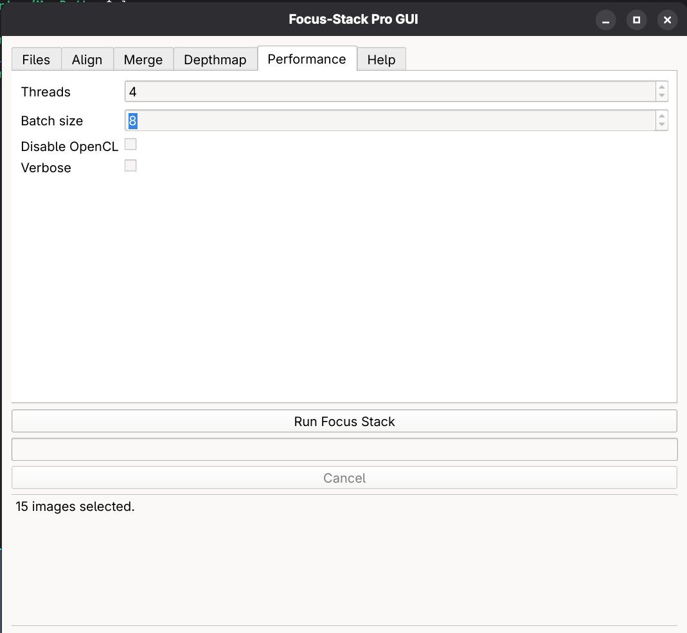

# FocusStack GUI (PyQt6)

Unofficial graphical interface for the Focus-stack CLI tool.

This project provides a clean and structured PyQt6-based graphical interface
for controlling the Focus-stack AppImage version with full exposure of CLI options.

It does not modify or repackage Focus-stack.  
It acts as a frontend wrapper around the official CLI executable.

---

## Purpose

Focus-stack is a powerful CLI-based focus stacking tool.
This GUI aims to:

- Provide easier access to all CLI parameters
- Offer visual image selection (thumbnail gallery mode)
- Improve usability for photographers
- Preserve full CLI flexibility
- Keep processing performance identical to CLI usage

---

## Why this GUI?

Focus-stack is powerful but CLI-based.
This GUI aims to:

- Make advanced options discoverable
- Provide safe defaults
- Allow professional workflows
- Keep full CLI compatibility
- Not modify Focus-stack itself

## Architecture

```
FocusStack GUI (PyQt6)
        ↓
subprocess execution
        ↓
Focus-stack CLI (AppImage)
        ↓
OpenCL (GPU acceleration when enabled)
```

The GUI does not implement any stacking logic.
All processing is performed by the official Focus-stack binary.

---

## Structure

```
focusstack-gui/
│
├── apps/
│   └── focusstack_gui/
│
├── docs/
│   ├── files_tab.png
│   ├── align_tab.png
│   ├── merge_tab.png
│   ├── depthmap_tab.png
│   ├── performance_tab.png
│   ├── help_tab.png
│   └── workflow.gif
│
├── requirements.txt
├── README.md
└── LICENSE
```
---

## Features

- Thumbnail image gallery (IconMode)
- Multi-selection & removal
- Full CLI parameter exposure:
  - Alignment options
  - Merge options
  - Depthmap options
  - Performance options
- Real-time console output
- Progress bar monitoring
- Threaded execution (non-blocking UI)
- Automatic output filename generation
- Optional dated output subfolder
- Tooltip-based inline CLI documentation
- Complete CLI help tab integrated

---

## Requirements

- Linux
- Python 3.11+
- Focus-stack AppImage
- PyQt6

---

## Screenshots

### Files Tab


### Align Tab


### Merge Tab


### Depthmap Tab


### Performance Tab


### Help Tab


## Workflow Demonstration


## Installation

### Clone repository

```bash
git clone https://github.com/yourname/focusstack-gui.git
cd focusstack-gui
```

### Create virtual environment

```bash
python3.11 -m venv venv311
source venv311/bin/activate
```

### Install dependencies

```bash
pip install -r requirements.txt
```

Minimal requirements:

```
PyQt6
```

---

## Configure Focus-stack path

Edit the binary path in the configuration file:

```
apps/focusstack_gui/config.py
```

Set:

```python
FOCUS_STACK_BIN = "/absolute/path/to/Focus-stack/AppRun"
```

Make sure the AppImage is extracted and executable.

---

## Run the application

```bash
source venv311/bin/activate
python -m apps.focusstack_gui.main
```

---

## Output behavior

- User selects output directory
- Optional auto-created folder:
  
  ```
  stack_YYYYMMDD_HHMMSS
  ```

- Output filename auto-generated:

  ```
  <first_image>_stack_<N>img_<timestamp>.jpg
  ```

Example:

```
IMG_1024_stack_15img_20260221_153045.jpg
```

---

## Design Goals

- Stay fully aligned with upstream CLI options
- No abstraction hiding functionality
- No performance overhead
- Keep code simple and maintainable
- Avoid platform-specific modifications

---

## Non-goals

- Replacing the official CLI
- Modifying Focus-stack internal algorithms
- Packaging Focus-stack binaries

---

## Status

Functional and stable.

Tested on:
- Fedora Linux
- NVIDIA RTX 4070 (OpenCL enabled)
- Python 3.11

---

## Possible Future Improvements

- Preset profiles
- EXIF-based automatic image ordering
- AppImage packaging of GUI
- Internationalization (i18n)
- Advanced log viewer

---

## License

MIT License

---

## Disclaimer

This project is not affiliated with the official Focus-stack project.
Focus-stack remains the property of its original author(s).
